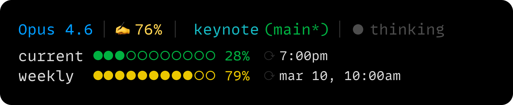

# claude-line

A status line for [Claude Code](https://docs.anthropic.com/en/docs/claude-code) that shows you useful info while you work.



## Install

```bash
npx claude-line
```

That's it. It copies the status line script to `~/.claude/statusline.sh` and configures your Claude Code settings.

## What it shows

**Line 1** — Model name, context window usage, current directory with git branch, and thinking mode status.

**Line 2+** — Rate limit usage with progress bars and reset times for your current window and weekly limits. If you have extra usage enabled, it shows your spend and monthly limit too.

Colors shift from green to yellow to red as usage increases.

## Requirements

- [jq](https://jqlang.github.io/jq/) — for parsing JSON
- curl — for fetching rate limit data
- git — for branch info

On macOS:

```bash
brew install jq
```

## How it works

Claude Code pipes JSON into the status line command on every update. The script parses it to extract model info, token counts, and session data. It also calls the Anthropic API using your existing OAuth token to fetch rate limit usage, cached for 60 seconds.

## Uninstall

```bash
npx claude-line --uninstall
```

If you had a previous statusline, it restores it from the backup. Otherwise it removes the script and cleans up your settings.

## License

MIT
